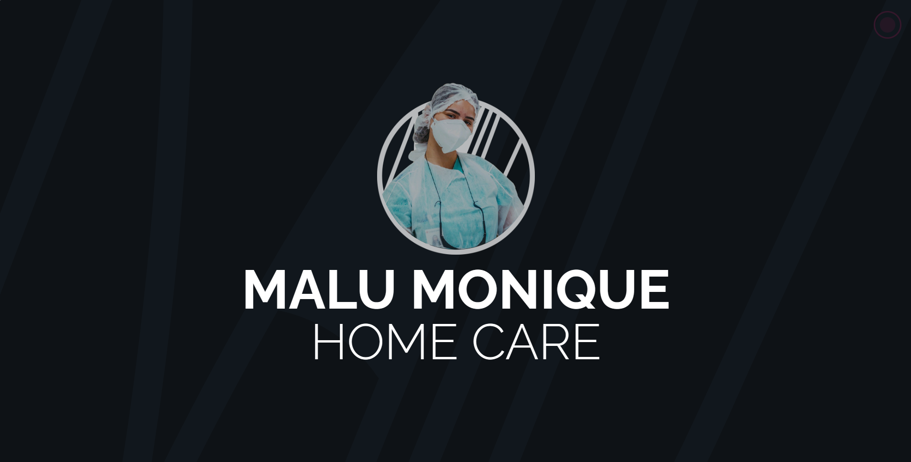

# MMVisitCard



**MMVisitCard** is an Angular SPA that replicates the elegance of a physical business card. It serves as a digital representation of the exceptional home care nursing services provided by Malu Monique. The SPA includes responsive design, contact information, and detailed service descriptions.

## Technology

Key technologies and tools employed in the development of this SPA:

- **Angular/SCSS**: Core technologies for creating a dynamic and responsive user interface.
- **Flexbox**: Utilized to create flexible and responsive layouts.

## Card-Inspired Layout

Drawing inspiration from physical business cards, MMVisitCard offers a sleek and intuitive layout. The design focuses on simplicity and clarity, ensuring a user-friendly experience.

## Contact and Services

The SPA prominently features contact details, including phone numbers, email addresses, and social media links, allowing users to connect with Malu Monique effortlessly. Service information is presented concisely, providing an overview of the nursing expertise offered.

## Viewing MMVisitCard Locally

To explore MMVisitCard on your local machine, follow these steps:

1. Clone the repository:

```bash
  git clone https://github.com/edsoncamargo/MMVisitCard
  cd your-path/MMVisitCard
```

2. Install the dependencies:

```bash
  npm install
```

3. Start the development server:

```bash
  ng serve -o
```

## Contribution

Contributions to enhance and refine MMVisitCard are encouraged. If you have suggestions, encounter issues, or wish to contribute new features, please open an issue or submit a pull request.

## License

This project is licensed under the [MIT LICENSE](./LICENSE).

## Contact

- Name: Edson Camargo Menezes
- Email: contact@edsoncamargo.dev

Embark on a digital journey with MMVisitCard and discover the essence of home care nursing by Malu Monique 🌿
